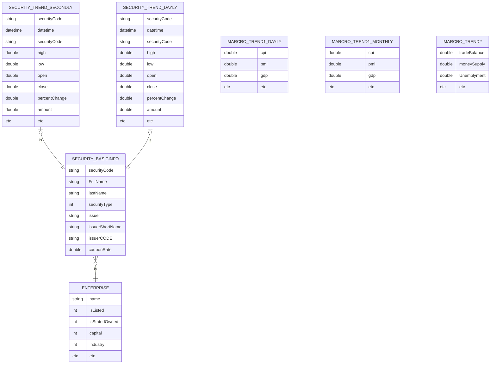

根据业务场景，大概需要用到两种类型的数据

时间序列类型数据

+ 证券价格时间序列表：证券代码+时间做复合主键，证券代码做外键链接到证券基本信息，不同频率使用多张表
+ 宏观指数时间序列：如果存在结构相同，存在同一张表中，用时间做主键。结构不同的存在不同表中，用指数名称和时间做复合主键。不同频率使用不同的表

基本资料数据：

+ 证券基本信息表：证券代码作为主键，同时证券代码作为外键链接到行情数据，企业代码做外键链接到企业基本信息
+ 企业基本信息表 ：企业代码做主键，同时做外键连接到相关证券

下面是简明ER图(为防止显示不正确，放了一张截图，因此可能会有两张)

----

---

大部分需要使用的数据都是时间序列类型的，若要存储数据，写频率较高，可以使用时间序列数据库，但又有一部分数据是非时间序列的，但这一部分使用频率可能不高，最终推荐使用TimeScaleDB数据库

TimescaleDB 是建立在 PostgreSQL 之上的一个开源时间序列数据库扩展，专门用于高效处理时间序列数据。它利用了 PostgreSQL 的灵活性和可扩展性，并添加了针对时间序列数据的优化功能，使得它成为处理大规模时间序列数据的理想选择。下面是备选数据库之前的比较

| 数据库应用                                                   | SQL支持  | 时间序列支持 | 可扩展性 | 费用     | 性能排名 | 用户数量 | 发布时间比较 | 分析                                                         |
| ------------------------------------------------------------ | -------- | ------------ | -------- | -------- | -------- | -------- | ------------ | ------------------------------------------------------------ |
|  | 部分支持 | 否           | 非常高   | 开源免费 | 一般     | 百万级   | 2009年       | 主要用于存储和查询非时间序列数据，适用于复杂的文档型数据和查询。 |
|  | 不支持   | 非常高       | 高       | 开源免费 | 非常高   | 十万级   | 2013年       | 专注于存储和查询时间序列数据，不适用于非时间序列数据的存储和查询。 |
|  | 不支持   | 非常高       | 较高     | 开源免费 | 非常高   | 十万级   | 2012年       | 用于收集、存储和查询监控数据，不适用于非时间序列数据的存储和查询。 |
|  | 支持     | 非常高       | 非常高   | 开源免费 | 高       | 十万级   | 2017年       | 专注于时序数据的管理与分析，适用于秒级存储和高写入频率的时间序列数据，也支持非时间序列数据的存储和查询。 |
|  | 支持     | 部分支持     | 一般     | 商业     | 一般     | 百万级   | 1989年       | 适用于多种企业级应用，包括非时间序列数据的存储和管理。       |
|  | 支持     | 部分支持     | 一般     | 开源免费 | 一般     | 百万级   | 1995年       | 适用于Web应用开发和数据管理。                                |
|  | 部分支持 | 高           | 高       | 开源免费 | 高       | 十万级   | 2012年       | 专门用于存储和查询大规模的时间序列数据。                     |
|  | 不支持   | 部分支持     | 非常高   | 开源免费 | 高       | 百万级   | 2008年       | 分布式数据库，适用于大规模数据处理和存储，可处理时间序列和非时间序列数据。· |
